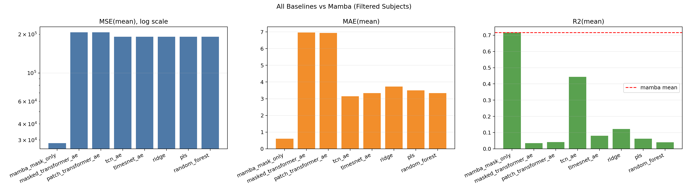
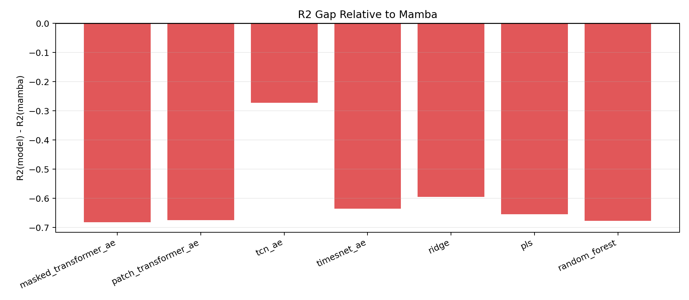

# 全量基线对比总结（深度模型 + 经典模型）

- 数据范围：filtered 后 28 个被试
- 指标口径：标准化空间 MAE/MSE/R2
- 说明：TimesNet_AE 仍使用 10 epochs 结果作为替代口径

## 均值总表

| 模型 | n_subjects | MSE(mean) | MAE(mean) | R2(mean) |
|---|---:|---:|---:|---:|
| mamba_mask_only | 28 | 28328.754064 | 0.600278 | 0.716563 |
| masked_transformer_ae | 28 | 207572.553277 | 6.963004 | 0.034492 |
| patch_transformer_ae | 28 | 207371.025069 | 6.935845 | 0.041453 |
| tcn_ae | 28 | 191933.203792 | 3.148998 | 0.444020 |
| timesnet_ae | 28 | 191941.231098 | 3.340972 | 0.080503 |
| ridge | 28 | 191918.156656 | 3.732757 | 0.121478 |
| pls | 28 | 191937.749992 | 3.499917 | 0.061732 |
| random_forest | 28 | 191942.262306 | 3.337856 | 0.039497 |

## 可视化

## 结论

1. 无论是深度基线（Patch/Masked/TCN/TimesNet）还是经典机器学习基线（Ridge/PLS/RandomForest），在 MAE/MSE/R2 均值上均未超过 mamba_mask_only。
2. 最强深度基线为 TCN_AE（R2 mean=0.444020），但仍显著低于 mamba_mask_only（R2 mean=0.716563）。
3. 经典基线中 R2 最好的是 Ridge（R2 mean=0.121478），明显落后于深度基线与主模型。
4. 从 R2 gap 图可见，所有基线相对 mamba 的差值均为负，验证了主模型的稳定领先。