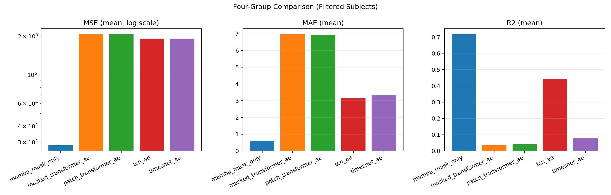
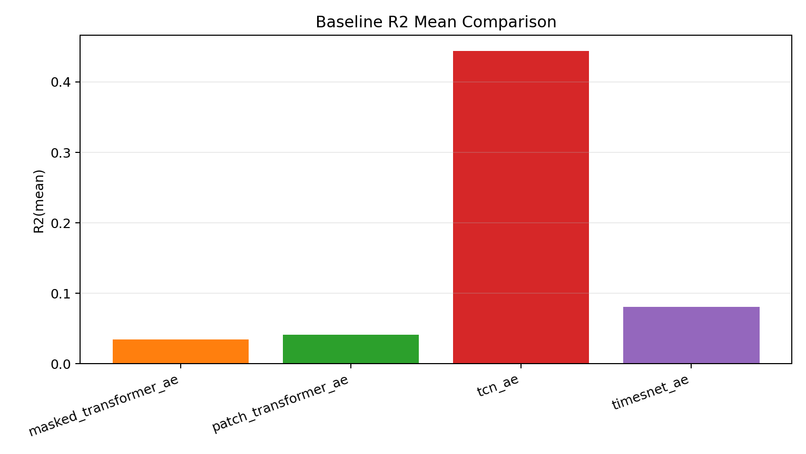
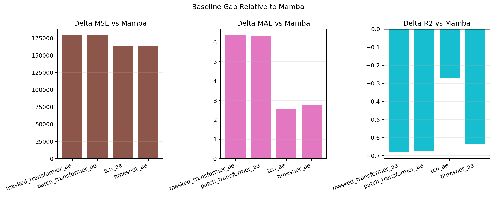

# 五组重建模型对照（Filtered Subjects, R2 >= 0）

- 数据范围：筛选后 28 个被试
- 指标空间：标准化空间（与现有 Mamba 汇总口径一致）
- 训练预算口径：按 40 epochs 对照总结
- 备注：受硬件限制，TimesNet_AE 使用 10 epochs 结果代替 40 epochs 结果进行总结

## 均值对照

| 模型 | n_subjects | MSE(mean) | MAE(mean) | R2(mean) |
|---|---:|---:|---:|---:|
| mamba_mask_only | 28 | 28328.754064 | 0.600278 | 0.716563 |
| masked_transformer_ae | 28 | 207572.553277 | 6.963004 | 0.034492 |
| patch_transformer_ae | 28 | 207371.025069 | 6.935845 | 0.041453 |
| tcn_ae | 28 | 191933.203792 | 3.148998 | 0.444020 |
| timesnet_ae | 28 | 191941.231098 | 3.340972 | 0.080503 |

## 可视化对比

图示说明：
1. 左图为 MSE 均值（对数坐标），用于缓解量级差异过大导致的可视化压缩。
2. 第二张图聚焦 baseline 内部的 R2 均值排序，便于观察谁更接近主模型。
3. 第三张图展示相对 Mamba 的差值（MSE/MAE 越小越好，R2 越大越好）。
4. 在当前口径下，mamba_mask_only 在三项指标上均优于四种深度 baseline。

## 稳健统计（中位数）与单被试胜场

| 模型 | MSE(median) | MAE(median) | R2(median) | R2胜过Mamba的被试数 |
|---|---:|---:|---:|---:|
| masked_transformer_ae | 1.050401 | 0.716790 | 0.059287 | 0 |
| patch_transformer_ae | 1.045368 | 0.709593 | 0.064102 | 0 |
| tcn_ae | 0.545434 | 0.492540 | 0.527502 | 3 |
| timesnet_ae | 1.041179 | 0.696632 | 0.081103 | 0 |

## 结论

1. 在当前 filtered 被试集上，Mamba 方案在 MAE/MSE/R2 均值上仍显著领先。
2. 在四种深度 baseline 中，TCN_AE 的 R2 表现最强（mean=0.444020），并在 3 个被试上超过 Mamba，但总体仍显著落后于 Mamba（mean R2=0.716563）。
3. TimesNet_AE（10 epochs 代替口径）相较两种 Transformer-AE 有提升，但当前仍明显低于 TCN_AE 与 Mamba。
4. 该版本可作为阶段性汇总；后续若硬件允许，建议补齐 TimesNet_AE 的 40 epochs 复跑以完成严格预算对齐。